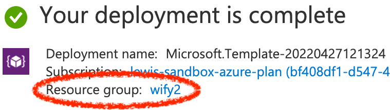

## Deploy

### Pre-requisites

- Access to an existing [Azure subscription](https://docs.microsoft.com/en-us/azure/guides/developer/azure-developer-guide#understanding-accounts-subscriptions-and-billing)
- If you don't have an Azure subscription, create an [Azure free account](https://azure.microsoft.com/free/?ref=microsoft.com&utm_source=microsoft.com&utm_medium=docs&utm_campaign=visualstudio) before you begin.

### Install

### Delete Installation

To delete this app installation, simply delete the resource group used by the deployment above:

1. Identify the resource group you specified in the deployment e.g.
    

1. [Delete the resource group](https://docs.microsoft.com/en-us/azure/azure-resource-manager/management/manage-resource-groups-portal#delete-resource-groups)
